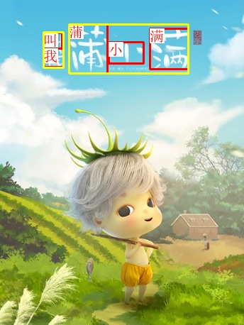
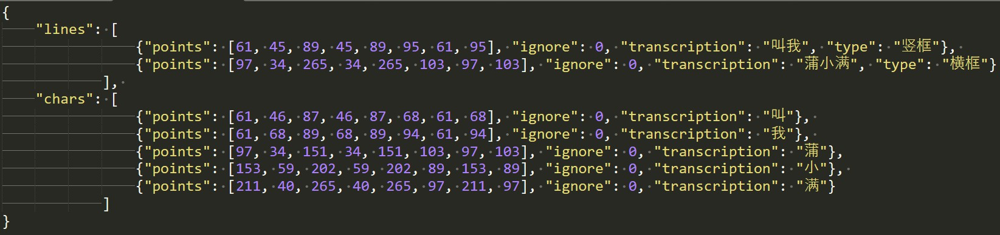
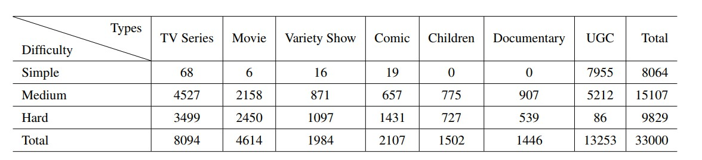
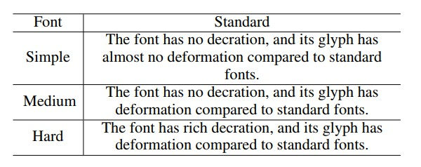
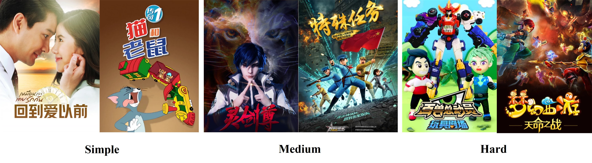
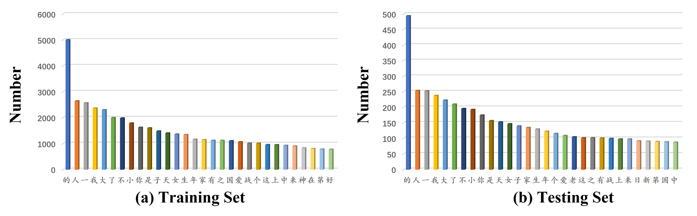
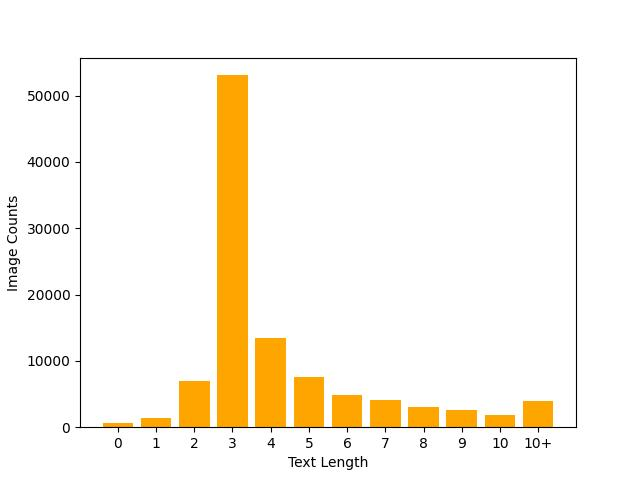

# ARText

ARText is the first Chinese Artistic Dataset used for text detection and recognition, which consists of 33, 000 Chinese artistic images collected from the Internet.

    

## Download

Download ARText dataset from:

https://pan.baidu.com/s/1gfdcArcFEEkpAu3KGiFhQQ   code: fe7n

## Data Resource

We collect our ARText images all from the Internet, trying to cover a wide content range. Then we impose data cleaning manually on them, removing images with low-resolution or inappropriate content. Finally, we category these images into different types as **UGC (User Generated Content), movies, TV series, children, comic, variety show and documentary**.

## Annotation Details

The annotation format in ARText is similar to [IC19-ReCTS](https://rrc.cvc.uab.es/?ch=12).

In each annotation, we provide text-level bounding box and character-level bounding box with their contents. The format of the bounding box includes four corner points of the orientated bounding box. In one image, there may be multiple texts in different font size, but we only focus on the main part and ignore some small texts.  

    

## Dataset Analysis

The whole dataset includes 33, 000 images with 3563 different kinds of Chinese characters. The dataset statistics can be seen below. 

    

We label dataset images into three categories (Simple, Medium, Hard) manually, according to the recognition difficulty standard (as described below). There are some image category examples

    

   

Moreover, we calculate the occurrence frequency of each character in both training set and testing set. The top-30 characters are presented here, and the character frequency distribution of training and testing set basically remains the same. 

We also calculate the text length distribution of the whole dataset. Note that there might be multiple text instances in one image, so the image counts can be larger than ARText image number.  

    

## Citation

