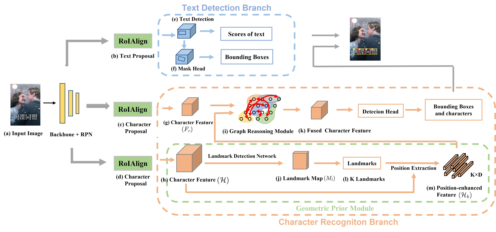

# DR TextSpotter

## Introduction

Official implementation of DR_TextSpotter.

<div align=center>
    
</div>

This code is based on [AE TextSpotter](https://github.com/whai362/AE_TextSpotter) and [MMDetection](https://github.com/open-mmlab/mmdetection/tree/v1.0rc1).

## ARText dataset

Please refer to the [detailed description](ARText/README.md) of ARText dataset.


## Install

Please refer to [MMDetection v1.0rc1](https://github.com/open-mmlab/mmdetection/tree/v1.0rc1) for installation.

**Recommended environment**

```
Python 3.6+
Pytorch 1.1.0
torchvision 0.2.1
pytorch_transformers 1.1.0
mmcv 0.2.13
Polygon3
opencv-python 4.4.0
```


## Preparing data

①Downloading [ARText](ARText/README.md) dataset

②unzip ARText in data folder, the structure should be

```
data/ARText/
├── train
│   ├── img
│   ├── gt
├── test
│   ├── img
```

③

```
python tools/rects_prepare_data.py
```


## Training

①train baseline

```
bash train_baseline.sh
```

②train Landmark Detection Network

```
bash train_landmark.sh
```

we train the Landmark Detection Network with 10w synthetic dataset.

③train the whole network

```
python modify.py
bash train.sh
```


## Test

```
bash test.sh
```


## Visualization

```
bash visualize.sh
```


## Evaluation

```
bash eval.sh
```


## Results and Models

link：https://pan.baidu.com/s/1r6sU9sP8oS2IzIErR0ylAA 
code：ubav 

link：https://pan.baidu.com/s/1OUiyfUTKL13IqksXGe9SDg 
code：2rjo 

## License
This project is released under the [Apache 2.0 license](LICENSE).

## Citation

